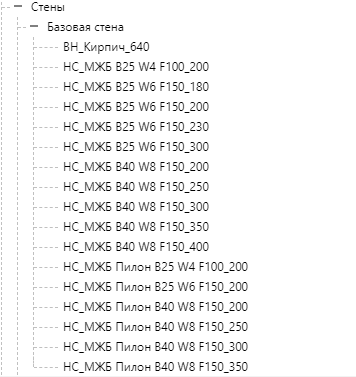

# 3.2 Вертикальные конструкции

Именовать системные компоненты фундаментов необходимо в соответствии с [правилами наименования системных семейств](../../reglament-bim/interactive-blocks.md).

### 1. **Стены** 

Стены моделируются системным семейством «Стены».

Для создания _несущих_ стен используется тип «Стена: несущая». Вкладка «Конструкция» -> панель «Стена» -> «Стена: несущая».

Для создания _ненесущих_ стен используется тип «Стена: архитектурная». Вкладка «Конструкция» -> панель «Стена» -> «Стена: архитектурная».

<figure><figcaption></figcaption></figure>

В шаблоне создан основной набор базовых типов стен, который может служить основой для дальнейшей разработки пользовательских типов стен.

<figure><figcaption></figcaption></figure>


Стены создаются поэтажно с корректным соотнесением зависимостей снизу и сверху к уровням (п. 1) и точной настройкой привязки смещения низа и верха в свойствах (п. 2).

1\. Для параметров «Зависимость снизу» и «Зависимость сверху» следует указывать уровень, к которому привязывается низ и верх стены соответственно.

2\. Привязка происходит от верхней отметки плиты перекрытия текущего этажа до нижней отметки плиты следующего этажа.



«Неприсоединенные» сверху стены высотой менее 2 м, всегда отображаются как проекция, даже если попали в разрез секущей плоскости.

Для корректного отображения нужно задавать зависимость сверху к конкретному уровню.



Запрещено создавать отверстия и проемы в стенах путём редактирования контура стены.

Редактирование контура стены допустимо только в местах перепада высот перекрытий.



### 2. **Колонны** 

Несущие колонны моделируются загружаемыми семействами категории «Несущие колонны».

В библиотеке семейств предусмотрены следующие семейства колонн:

-210\_Колонна\_Монолитная\_Прямоугольная

<figure><figcaption></figcaption></figure>

– 210\_Колонна\_Монолитная\_Круглая

<figure><figcaption></figcaption></figure>


Несущие колонны создаются поэтажно с корректным соотнесением зависимостей снизу и сверху к уровням (п. 1) и точной настройкой привязки смещения низа и верха в свойствах (п. 2).

1\. Для параметров «Зависимость снизу» и «Зависимость сверху» следует указывать уровень, к которому привязывается низ и верх стены соответственно.

2\. Привязка происходит от верхней отметки плиты перекрытия текущего этажа до нижней отметки плиты следующего этажа.


### 3. **Пилоны** 

Моделирование пилонов осуществляется системными семействами категории «Стены».

Для пилонов должен быть предусмотрен отдельный тип с префиксом 03\_ и описанием \_Пилон.

В шаблоне создан основной набор базовых типов пилонов, который может служить основой для дальнейшей разработки пользовательских типов.

<figure><figcaption></figcaption></figure>

