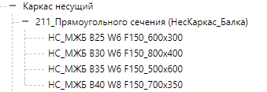

# 3.3 Горизонтальные конструкции

Именовать системные компоненты фундаментов необходимо в соответствии с [правилами наименования системных семейств](../../reglament-bim/interactive-blocks.md).

### 1. **Перекрытия** 

Монолитные плиты перекрытия и покрытия моделируются системными семействами категории «Перекрытия».

Вкладка «Конструкция» -> панель «Конструкция» -> «Пол/Перекрытие» -> «Перекрытие: несущее».

<figure><figcaption></figcaption></figure>

[Правило именования категории "Перекрытия" указано в пунке 10.2](../../reglament-bim/pravila-imenovaniya-soderzhimogo-revit/pravilo-imenovaniya-kategorii-prekrytiya-lestnichnye-ploshadki-fundamentnye-plity.md)

<figure><figcaption></figcaption></figure>


– Запрещено создавать отверстия и проемы в перекрытиях путём редактирования контура основы.

Исключение: крупногабаритные проемы в перекрытии (проем под лестничную клетку, шахта лифта и т.п.) создаются редактированием контура.

– Не допускается создание двух элементов перекрытия в одном эскизе.

&#x20;                                                         

&#x20;                                                                                                 ↓

&#x20;                                                         



– При построении перекрытие привязывается к ближайшему уровню с необходимым смещением от него.

**Запрещено** создавать дополнительные уровни по отметкам верха плит перекрытия!


### 2. **Капители** 

Капители моделируются системными семействами категории «Перекрытия».

Вкладка «Конструкция» -> панель «Конструкция» -> «Пол/Перекрытие» -> «Перекрытие: несущее».

<figure><figcaption></figcaption></figure>

Построение капители осуществляется в режиме эскиза, который должен образовывать замкнутый контур, а линии эскиза не должны пересекаться.


Не допускается создание двух капителей в одном эскизе.

&#x20;                                                              

&#x20;                                                                                                       ↓

&#x20;                                                             



Смещение от уровня для капители должно быть равно смещению от уровня плиты перекрытия.

Также для корректного подсчета объемов геометрия капителей должна быть соединена с геометрией плиты перекрытия. При присоединении перекрытие имеет приоритет перед капителью, т.е. геометрия капители должна вырезаться геометрией плиты.

&#x20;                                                           


Капители сложной формы (например, в виде усеченной четырехгранной пирамиды) необходимо моделировать отдельными семействами категории «Перекрытие».

### 3. **Балки** 

Железобетонные балки моделируются с помощью загружаемых семейств категории «Каркас несущий».

<figure><figcaption></figcaption></figure>

Высота типов балок принимается с учетом толщины перекрытия.


**При моделировании балок, опирающихся на несущие колонны**, нужно соблюдать правила примыкания. Это важно для корректного подсчёта объёмов бетона на разные типы конструкций. По умолчанию верным принимается следующее примыкание: балка вырезает объём из несущей колонны.

Для корректного подсчета объемов балки должны быть соединены с перекрытиями. При присоединении перекрытие имеет приоритет перед балкой.


**Порядок построения эскиза балки**:

1. Выбрать вкладку «Конструкция», панель «Конструкция» (Балка).
2. На панели параметров задать следующие настройки:

* **Указать плоскость размещения**, если требуется рабочая плоскость, отличная от текущего уровня.
* **Указать для балки параметр «Использование в конструкции»**.
* **Выбрать 3D-привязку** для привязки к другим несущим элементам в любом виде. Эскизы балок можно строить за пределами текущей рабочей плоскости.
* **Выбрать параметр «Цепь»**, чтобы разместить балки в виде непрерывной последовательности. Второй щелчок при размещении балки указывает начало следующей балки.
* **Нарисовать эскиз балки**, щелчком мыши указав её начальную и конечную точки в области рисования.

3. При рисовании эскиза балки выполняется привязка курсора к другим несущим элементам, например к центру масс колонны или к осевой линии стены. Место привязки курсора отображается в строке состояния.
4. Для определения точной длины балки при создании эскизов щёлкнуть начальную точку и переместить курсор в направлении, в котором должна располагаться балка. Начать вводить требуемую длину и нажать клавишу ENTER для размещения балок.
