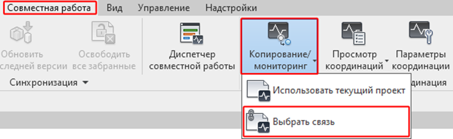
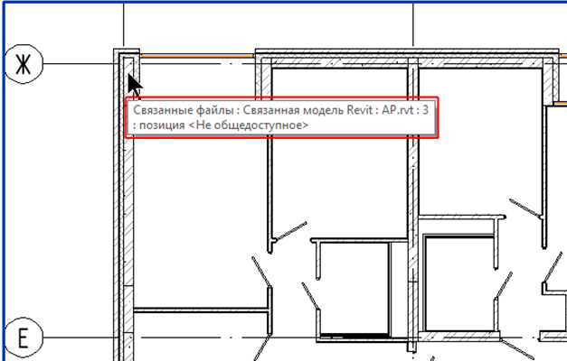
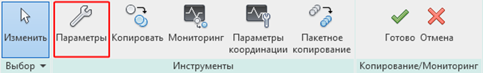
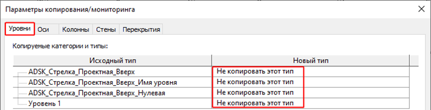
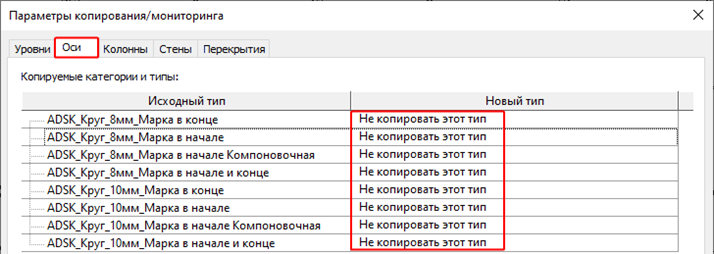

# Копирование железобетонных конструкций из модели АР

Для того, чтобы скопировать готовые элементы КЖ из модели АР и не моделировать их с нуля, мы можем использовать функцию Копирования с последующим Мониторингом.

С помощью мониторинга также можно отслеживать положения, имена и актуальность объектов в нашей и связанной модели.

Для этого следует придерживаться следующей очередности действий:

1\. Проверить загружена ли связь АР в модель;

2\. На вкладке «Совместная работа» → раскрываем список «Копирование/Мониторинг» → команда «Выбрать связь»;

<figure><figcaption></figcaption></figure>

3\. Навести курсор на связь АР (при необходимости перебрать связи с помощью Tab, должна появиться подсказка, что подсвечена именно связь АР) и выбрать ее;

<figure><figcaption></figcaption></figure>

4. Появится новая вкладка Копирование/Мониторинг (выделена зеленым цветом) со встроенными функциями;

<figure><figcaption></figcaption></figure>

5. Предварительно необходимо сопоставить копируемые типоразмеры элементов из модели АР типоразмерам в шаблоне КЖ, для этого открываем «Параметры».

<figure><figcaption></figcaption></figure>

Для вкладок Уровни и Оси, указываем «Не копировать этот тип», к этому моменту они уже должны быть настроены в проекте;

<figure><figcaption></figcaption></figure>

<figure><figcaption></figcaption></figure>

Далее для колонн, стен и перекрытий настраиваем сопоставление только нужным типам, для всех ненужных указываем «Не копировать этот тип».
