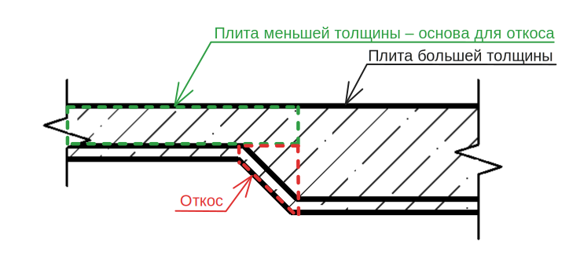
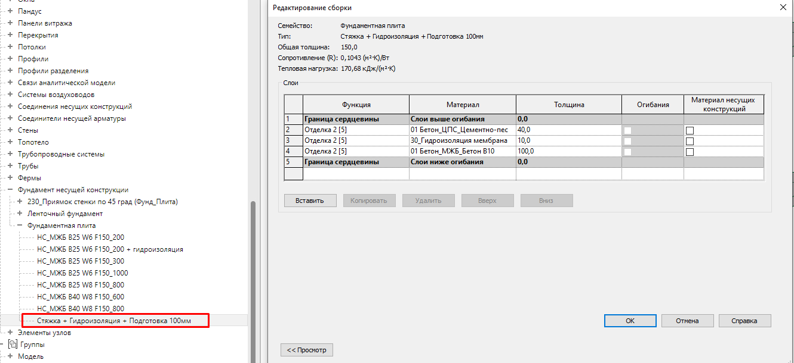

# Фундамент

Для моделирования фундаментов используются инструменты на панели «Фундамент» в зависимости от типа проектируемого фундамента.

<figure><figcaption></figcaption></figure>

Именовать системные компоненты фундаментов необходимо в соответствии с [правилами наименования системных семейств](../../reglament-bim/interactive-blocks.md).

## 1. **Фундаментная плита**

Монолитная фундаментная плита моделируется системным семейством «Фундамент несущей конструкции: перекрытие».

Построение осуществляется в режиме эскиза, который должен образовывать замкнутый контур, а линии эскиза не должны пересекаться.

<figure><figcaption></figcaption></figure>

В шаблоне создан основной набор базовых типов фундаментов, который может служить основой для дальнейшей разработки пользовательских типов.

<figure><figcaption></figcaption></figure>

## **2. Приямок фундамента**

**Приямок с откосами** (наклонными гранями) моделируется с помощью загружаемого семейства «230\_НС\_МЖБ В25 W6 F150\_Приямок стенки по 45 град (Фунд\_Плита)»

<figure><figcaption>
<strong>Отко</strong>
</figcaption></figure>

**Откос фундаментной плиты (перепад)** моделируется моделью в контексте в категории "Фундамент несущей кострукции"

Основой в данном случае будет служить плита с меньшей толщиной

<figure><figcaption></figcaption></figure>

### **Сваи**

Моделирование свай осуществляется загружаемыми семействами.

Сваи должны быть соединены с примыкающими конструкциями (ростверками, плитами) и должны вырезать в них соответствующий объем.

## 3. **Подготовка**

Подготовка относится к категории «Фундамент несущей конструкции».

### Горизонтальная подготовка

Горизонтальные участки подготовки под фундаментную плиту необходимо выполнять системным семейством «Фундамент несущей конструкции: перекрытие».

<figure><figcaption></figcaption></figure>

В шаблоне создан основной набор базовых типов подготовки, который может служить основой для дальнейшей разработки пользовательских типов.

<figure><figcaption></figcaption></figure>

