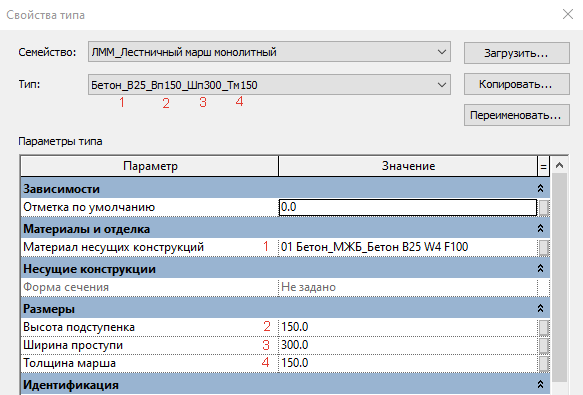

# Лестницы

### **1. Лестничные марши** 

Конструктивные лестницы моделируются инструментом, обеспечивающим корректное отображение объёма всей лестницы и / или лестничных маршей и лестничных площадок в отдельности.

Моделирование лестничных маршей _с отличающейся высотой нижней/верхней ступеней_ от остальных выполняется загружаемым семейством марша категории «Каркас несущий».

### **1.1 ЛММ\_Лестничный марш монолитный** 

**Параметры типа** в семействе определяют следующие характеристики марша:

1 – Материал марша.

2 – Высота подступенка;

3 – Ширина подступенка;

4 – Конструктивная толщина марша.

<figure><figcaption></figcaption></figure> <figure><figcaption></figcaption></figure>

**Параметры экземпляра** определяют следующие характеристики каждого марша:

1 – Линия обрыва марша. Включается для обозначения обрыва по ГОСТ для второго пролета марша;

2 – Ширина марша;

3 – Высота марша. Измеряется от верха нижележащего перекрытия до верха вышележащего перекрытия;

4 – Высота верхнего подступенка марша. Задается для корректировки высоты завершающего подступенка. По умолчанию = 0, в таком случае высота последнего подступенка будет равна основной. При этом также будет корректироваться высота первого подступенка автоматически;

5 – Толщина нижнего марша. Параметр необходим для корректного построения геометрии между маршем и плитой;

6 – Толщина верхнего марша. Параметр необходим для корректного построения геометрии между маршем и плитой;

<figure><figcaption></figcaption></figure>

<figure><figcaption></figcaption></figure> <figure><figcaption></figcaption></figure>

Марш должен быть соединен к перекрытиям и из него должен вырезаться соответствующий объем плиты. Для этого необходимо воспользоваться инструментами «Соединить» и «Переключить порядок соединения».

<figure><figcaption></figcaption></figure>

Если материал марша отличается от материала плиты, то будет видна разделяющая линия между геометрией марша и плитой, даже при соединении.

При необходимости подрезки плиты под наклонную грань марша необходимо воспользоваться инструментом «Вырезать».

<figure><figcaption></figcaption></figure>

В порядке исключения, геометрически сложные и уникальные типы маршей допускается выполнять инструментом «Модель в контексте» категории «Каркас несущий».


При применении системного инструмента по созданию лестницы, необходимо соблюдать правило, что лестница создаётся для каждого этажа индивидуально. Недопустимо моделирование нескольких элементов за одну операцию.


### **2. Лестничные площадки** 

Лестничные площадки моделируются системными семействами категории «Перекрытия».

Для межэтажных лестничных площадок применяется описание \_Лестничная площадка.

<figure><figcaption></figcaption></figure>

