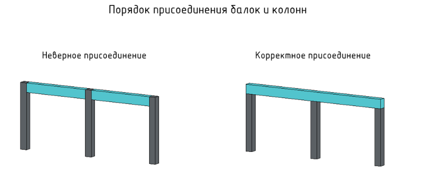

# Правила моделирования конструктивных элементов

### Порядок присоединения балок и колонн

При моделировании балок, опирающихся на несущие колонны, нужно соблюдать правила примыкания. Это важно для корректного подсчета объемов бетона на разные типы конструкций.\
По умолчанию верным принимается следующее примыкание: балка (каркас несущий) вырезает объем из несущей колонны

<figure><figcaption></figcaption></figure>
