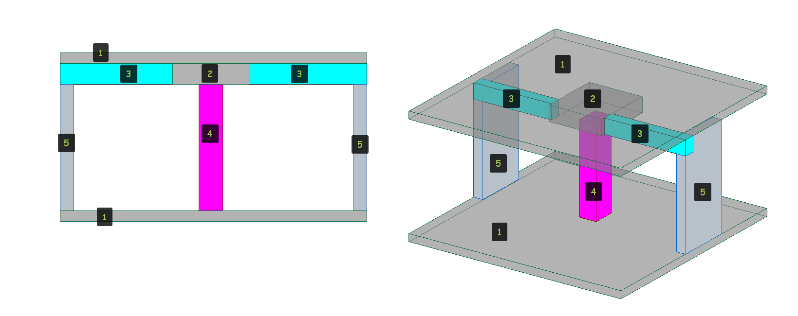

# Правила приоритета железобетонных конструкций

## Приоритеты соединения конструкций

Приоритеты присоединения конструкций выставленые по цифрам от 1 до 5, где 1 является высшим приоритетом.

1. Фундаментная плита ( Плита перекрытия)
2. Капитель
3. Балка
4. Колонна&#x20;
5. Стена

<figure><figcaption></figcaption></figure>
